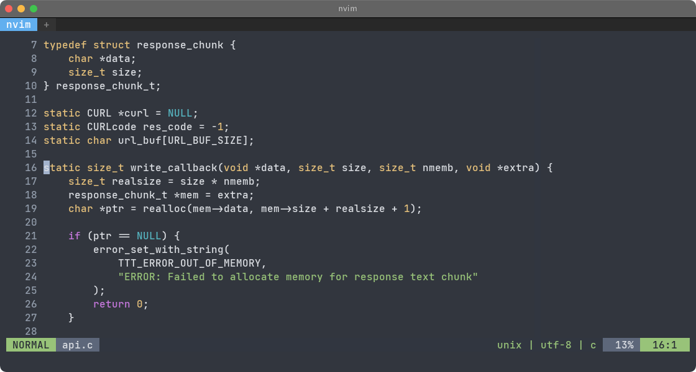
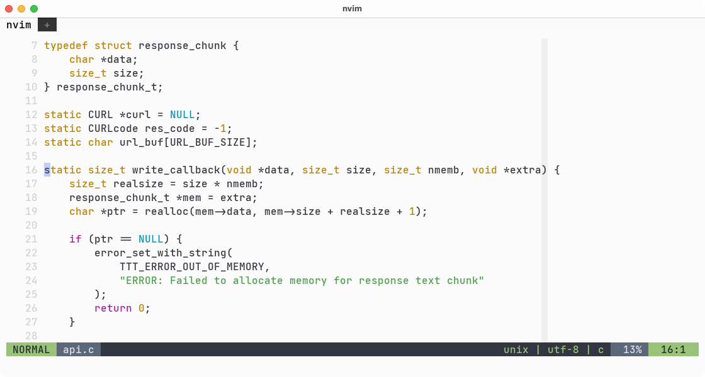
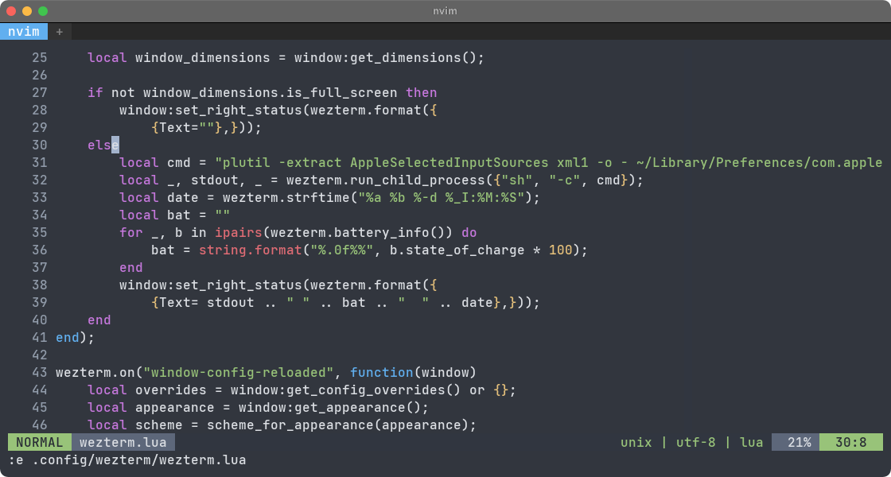
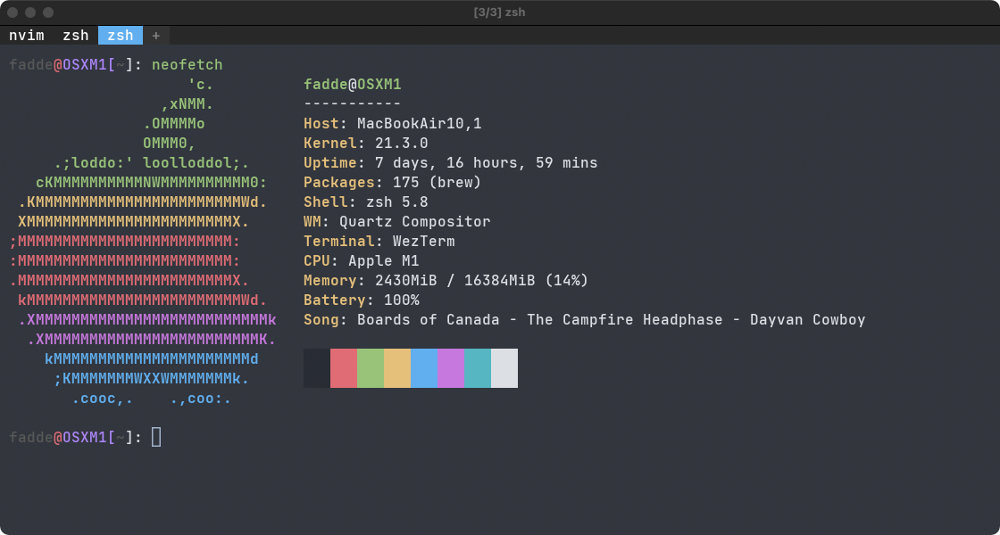
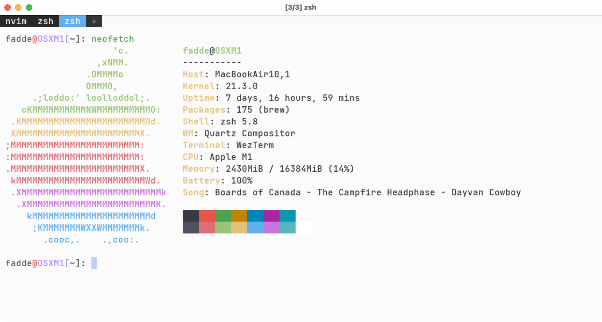

```
                                   _       _    __ _ _
                                  | |     | |  / _(_) |
                                __| | ___ | |_| |_ _| | ___  ___
                               / _` |/ _ \| __|  _| | |/ _ \/ __|
                              | (_| | (_) | |_| | | | |  __/\__ \
                               \__,_|\___/ \__|_| |_|_|\___||___/
                                --------------------------------
                           swiss army knife of any software engineer
                         ----------------------------------------------

             -----------------------------------------------------------------------
             This repository is the collection of configurations that I learned over
             time and still use for my  daily work. The repository contains  configs
             files for vim,  tmux and etc.  
             -----------------------------------------------------------------------
```    

## Screenshots






